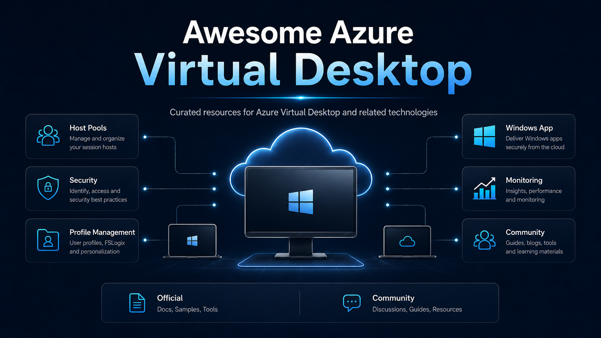

# Awesome Azure Virtual Desktop

A curated list of links and resources for **Azure Virtual Desktop** and its related technologies. Inspired by [Awesome Azure Architecture](https://aka.ms/AwesomeAzureArchitecture), which follows a similar model for Azure architecture links, this repository centralizes knowledge for professionals deploying or managing cloud-hosted virtual desktops and remote applications.

---

## Table of Contents

- [Official](#official)
  - [What's new in Azure Virtual Desktop?](#whats-new-in-azure-virtual-desktop)
  - [Azure Virtual Desktop](#azure-virtual-desktop)
  - [Azure Virtual Desktop Hybrid and Azure Local](#azure-virtual-desktop-hybrid-and-azure-local)
  - [FSLogix](#fslogix)
  - [Azure Files](#azure-files)
  - [App Attach](#app-attach)
  - [Windows App](#windows-app)
  - [Windows 365](#windows-365)
  - [Windows 365 Link](#windows-365-link)
  - [Microsoft Intune](#microsoft-intune)
  - [Monitoring and Insights](#monitoring-and-insights)
  - [Network](#network)
  - [Architecture and Best Practices](#architecture-and-best-practices)
  - [GitHub Repositories](#github-repositories)
- [Third Party](#third-party)
  - [Management Platforms](#management-platforms)
    - [Nerdio](#nerdio)
    - [ControlUp](#controlup)
    - [Hydra by Login VSI](#hydra-by-login-vsi)
    - [Citrix](#citrix)
  - [Testing and Assessment](#testing-and-assessment)
    - [Login VSI](#login-vsi)
    - [Lakeside SysTrack](#lakeside-systrack)
    - [Rimo3](#rimo3)
  - [Thin Clients](#thin-clients)
    - [IGEL](#igel)
    - [10ZiG](#10zig)
- [Community](#community)
  - [Blog](#blog)
  - [LinkedIn](#linkedin)
  - [YouTube](#youtube)
  - [GitHub Repos and Tools](#github-repos-and-tools)
  - [Chats and Channels](#chats-and-channels)
  - [Trainings](#trainings)
  - [Events](#events)

---
<!-- AWESOMEAZUREVIRTUALDESKTOP:START -->
## Official
*Only official links published or maintained by Microsoft or Azure.*

### What's new in Azure Virtual Desktop

[What's new in Azure Virtual Desktop?](https://learn.microsoft.com/en-us/azure/virtual-desktop/whats-new)

Azure Virtual Desktop receives continuous monthly service updates. Below is a summary of key updates from May 2025 onward.

#### Autoscale and Host Pool Management
- **Session host creation using a session host configuration** *(June 2025)* - extending session host creation, auto-retry behavior and diagnostics for host pools that use session host configuration.
- **Managed identity support for session host configuration** *(validation host pools: August 2025; all host pools: September 2025)* - removing the need to assign permissions to the Azure Virtual Desktop service principal when creating and updating session hosts.
- **Ephemeral OS disk support** *(Public preview: October 2025)* - enabling stateless session hosts to use local VM storage for faster provisioning, reimaging and performance.
- **RDP Multipath** *(GA: July 2025; fully rolled out: November 2025; redundant TCP GA rollout: May 2026)* - improving connection reliability by using multiple network paths between the client and session host or Cloud PC.
- **Azure Virtual Desktop for hybrid environments with Arc-enabled servers** *(Public preview: May 2026)* - allowing session hosts to run on any hypervisor or bare-metal Windows Server through the Azure Arc extension, without VM provisioning or power management in this preview.

#### App Delivery and Profile Management
- **App Attach** *(MSIX App Attach deprecated: June 2025; Windows Server 2025 and 2022 support: April 2026)* - supports MSIX, Appx and App-V package formats and simplifies the staging and assignment workflow through the Azure portal.
- **FSLogix support for cloud-only and external identities** *(Preview: November 2025)* - enabling FSLogix profile containers for both cloud-only and external identities in pooled host pools.
- **Enhanced RemoteApps** *(Preview: November 2025)* - improving RemoteApp behavior with better Windows Snap support, full-screen mode, DPI handling and visual integration with Windows.

#### Security and Compliance
- **Select redirections disabled for new host pools** *(July 2025)* - disabling clipboard, drive, opaque low-level USB and printer redirections by default for newly created host pools.
- **Token protection support in Windows App on Windows devices** *(GA: August 2025)* - allowing Conditional Access policies to require sign-in tokens that can only be used from the intended device.
- **External identity support** *(Preview without FSLogix: September 2025; GA: November 2025; additional client support: April 2026)* - allowing external identities to access Azure Virtual Desktop resources with expanded client support.
- **Centralized RDP Shortpath management** *(GA: January 2026)* - enabling administrators to configure RDP Shortpath transport modes through Microsoft Intune or Group Policy.
- **RDP Shortpath over Private Link** *(GA: February 2026)* - enabling UDP-based RDP Shortpath connections over Azure Private Link with explicit opt-in.
- **Windows Cloud Keyboard Input Protection** *(Preview: November 2025)* - encrypting keystrokes at the kernel level to help protect sessions from keylogger malware and endpoint threats.

#### Client Experience
- **Direct launch URLs for Windows App** *(May 2025)* - allowing users to connect directly to a specific desktop or application resource from a browser link.
- **Multiple personal desktops for a single user** *(GA: May 2025)* - assigning more than one personal desktop to a user in a single host pool.
- **HEVC/H.265 hardware acceleration** *(GA: June 2025)* - improving GPU-accelerated frame encoding for graphical workloads in Azure Virtual Desktop sessions.
- **Microsoft Teams media optimization** *(iOS and iPadOS preview: June 2025; WebRTC-based Teams GA and macOS preview: March 2026)* - reducing latency and improving call quality for meetings running inside AVD sessions through newer optimization architectures.

### Azure Virtual Desktop

- [Azure Virtual Desktop Documentation (Microsoft Docs)](https://learn.microsoft.com/en-us/azure/virtual-desktop/)  
  Complete documentation for deploying and managing Azure Virtual Desktop.
- [Azure Virtual Desktop Product Page](https://azure.microsoft.com/en-us/products/virtual-desktop/)  
  Official product page for Azure Virtual Desktop on the Azure website.
- [What's new in Azure Virtual Desktop (Microsoft Docs)](https://learn.microsoft.com/en-us/azure/virtual-desktop/whats-new)  
  Monthly updates listing the latest features and improvements in Azure Virtual Desktop.
- [Azure Virtual Desktop Pricing](https://azure.microsoft.com/en-us/pricing/details/virtual-desktop/)  
  Overview of the per-user access pricing model and session host virtual machine costs.
- [Prerequisites for Azure Virtual Desktop (Microsoft Docs)](https://learn.microsoft.com/en-us/azure/virtual-desktop/prerequisites)  
  Network, identity and subscription requirements before deploying Azure Virtual Desktop.
- [Create a host pool (Microsoft Docs)](https://learn.microsoft.com/en-us/azure/virtual-desktop/create-host-pool)  
  Step-by-step guide to creating pooled or personal host pools in Azure Virtual Desktop.
- [Autoscale for Azure Virtual Desktop (Microsoft Docs)](https://learn.microsoft.com/en-us/azure/virtual-desktop/autoscale-scaling-plan)  
  How to configure scaling plans to automatically start and stop session hosts based on demand, reducing compute costs.
- [Personal desktop assignment (Microsoft Docs)](https://learn.microsoft.com/en-us/azure/virtual-desktop/configure-host-pool-personal-desktop-assignment-type)
  How to configure automatic or direct assignment for personal desktops, including multiple personal desktops per user.
- [RemoteApp streaming (Microsoft Docs)](https://learn.microsoft.com/en-us/azure/virtual-desktop/publish-applications-stream-remoteapp)  
  How to publish individual applications instead of full desktops using RemoteApp, reducing bandwidth and simplifying the user experience.
- [Watermarking in Azure Virtual Desktop (Microsoft Docs)](https://learn.microsoft.com/en-us/azure/virtual-desktop/watermarking)  
  How to enable QR-code watermarks in RDP sessions to deter and trace unauthorized screen captures.
- [Screen capture protection (Microsoft Docs)](https://learn.microsoft.com/en-us/azure/virtual-desktop/screen-capture-protection)  
  Policy that prevents client-side tools from capturing session content, relevant for regulated industries.
- [Licensing Azure Virtual Desktop (Microsoft Docs)](https://learn.microsoft.com/en-us/azure/virtual-desktop/licensing)
  Eligible Windows, Microsoft 365 and Remote Desktop Services licenses for Azure Virtual Desktop deployments.
- [Azure Virtual Desktop Security Guide (Microsoft Docs)](https://learn.microsoft.com/en-us/azure/virtual-desktop/security-guide)  
  Security guidance for AVD deployments covering identity, networking, session security and data protection.
- [Optimize Azure Virtual Desktop using insights from a Well-Architected Review Assessment (Tech Community)](https://techcommunity.microsoft.com/blog/AzureArchitectureBlog/optimize-azure-virtual-desktop-using-insights-from-a-well-architected-review-assessment/4375459)  
  Guidance on evaluating AVD environments with the Well-Architected Framework assessment to identify risks, measure maturity and improve architecture quality.

### Azure Virtual Desktop Hybrid and Azure Local

- [Azure Virtual Desktop Hybrid Overview (Microsoft Docs)](https://learn.microsoft.com/en-us/azure/virtual-desktop/hybrid-overview)  
  Overview of Azure Virtual Desktop Hybrid, which keeps the AVD service in Azure while running session hosts on any on-premises hypervisor or bare-metal Windows Server. It is in public preview with validation host pools only and does not support Windows 10 or Windows 11 Enterprise multi-session.
- [Azure Virtual Desktop on Azure Local (Microsoft Docs)](https://learn.microsoft.com/en-us/azure/virtual-desktop/azure-local-overview)  
  Running Azure Virtual Desktop session hosts on Azure Local for data residency, latency and on-premises scenarios. In contrast to generic AVD Hybrid, Azure Local also supports Windows 11 and Windows 10 Enterprise multi-session alongside single-session desktops and Windows Server images.
- [Awesome Azure Local - Azure Virtual Desktop (GitHub)](https://github.com/schmittnieto/awesome-azure-local#avd)  
  Companion curated list for Azure Local with a dedicated Azure Virtual Desktop section covering deployment, management tooling and community resources for running AVD on Azure Local.

### FSLogix

- [FSLogix Documentation (Microsoft Docs)](https://learn.microsoft.com/en-us/fslogix/)  
  Complete documentation for FSLogix profile and Office container solutions, now part of Microsoft 365.
- [FSLogix profile containers with Azure Virtual Desktop (Microsoft Docs)](https://learn.microsoft.com/en-us/azure/virtual-desktop/fslogix-profile-containers)
  How FSLogix profile containers redirect and persist user profiles in non-persistent virtual environments, replacing roaming profiles and folder redirection.
- [Configure FSLogix profile containers with Azure Files (Microsoft Docs)](https://learn.microsoft.com/en-us/fslogix/how-to-configure-profile-container-azure-files-active-directory)
  How to use Azure Files (SMB) as a storage backend for FSLogix profile containers, suitable for most small and medium deployments.
- [Configure FSLogix profile containers with Azure NetApp Files (Microsoft Docs)](https://learn.microsoft.com/en-us/fslogix/how-to-configure-profile-container-netapp)
  How to use Azure NetApp Files for high-performance FSLogix profile storage in large deployments or latency-sensitive workloads.
- [FSLogix Cloud Cache (Microsoft Docs)](https://learn.microsoft.com/en-us/fslogix/concepts-fslogix-cloud-cache)
  How to use FSLogix Cloud Cache to replicate profile containers across multiple storage locations for resilience and business continuity.
- [What's new in FSLogix (Microsoft Docs)](https://learn.microsoft.com/en-us/fslogix/whats-new)  
  Release notes and update history for FSLogix versions.

### Azure Files

- [Azure Files Documentation (Microsoft Docs)](https://learn.microsoft.com/en-us/azure/storage/files/)
  Documentation hub for Azure Files, the managed SMB file share service commonly used as FSLogix profile container storage for AVD.
- [Overview of Azure Files identity-based authentication for SMB access (Microsoft Docs)](https://learn.microsoft.com/en-us/azure/storage/files/storage-files-active-directory-overview)
  Overview of identity-based access for Azure Files over SMB, including share-level, directory-level and file-level permission models.
- [Enable Microsoft Entra Kerberos authentication for hybrid and cloud-only identities on Azure Files (Microsoft Docs)](https://learn.microsoft.com/en-us/azure/storage/files/storage-files-identity-auth-hybrid-identities-enable?tabs=azure-portal%2Cintune)
  How to enable Kerberos authentication for Azure Files with hybrid identities and cloud-only identities in preview, useful for FSLogix profile containers on Entra-joined AVD session hosts.
- [Assign share-level permissions for Azure file shares (Microsoft Docs)](https://learn.microsoft.com/en-us/azure/storage/files/storage-files-identity-assign-share-level-permissions)
  How to grant SMB access with Azure RBAC roles or default share-level permissions, including the default permission model required for cloud-only identities in preview.
- [Configure directory and file-level permissions for Azure Files (Microsoft Docs)](https://learn.microsoft.com/en-us/azure/storage/files/storage-files-identity-configure-file-level-permissions)
  How to configure Windows ACLs for Azure file shares, including differences between hybrid identities and cloud-only identities when using Microsoft Entra Kerberos.
- [Entra-only identities for Azure Files SMB now generally available (Azure Blog)](https://azure.microsoft.com/en-us/blog/azure-files-entra-only-identities-advancing-cloud-native-identity-and-security/)
  Announcement of the general availability (May 19, 2026) of Microsoft Entra-only identities for Azure Files SMB, enabling identity-based access to SMB file shares using cloud-only Entra ID accounts without on-premises Active Directory, which is directly relevant to FSLogix profile containers on Entra-joined AVD session hosts.

### App Attach

- [App Attach overview (Microsoft Docs)](https://learn.microsoft.com/en-us/azure/virtual-desktop/app-attach-overview)  
  Introduction to App Attach, which allows MSIX, Appx and App-V packages to be staged and delivered dynamically to AVD session hosts without installation.
- [Set up App Attach (Microsoft Docs)](https://learn.microsoft.com/en-us/azure/virtual-desktop/app-attach-setup)  
  Step-by-step guide to configuring App Attach in the Azure portal, including image storage in Azure Files and assignment to host pools.
- [MSIX Packaging Tool (Microsoft Docs)](https://learn.microsoft.com/en-us/windows/msix/packaging-tool/tool-overview)  
  Documentation for the MSIX Packaging Tool used to convert existing application installers to MSIX format for use with App Attach.
- [Test MSIX App Attach packages (Microsoft Docs)](https://learn.microsoft.com/en-us/azure/virtual-desktop/app-attach-test-msix-packages)  
  How to validate MSIX packages before deploying them through App Attach to avoid session host issues.

### Windows App

- [Windows App Documentation (Microsoft Docs)](https://learn.microsoft.com/en-us/windows-app/)  
  Documentation for Windows App, the unified Microsoft client for Azure Virtual Desktop, Windows 365 and Remote Desktop Services.
- [Get started with Windows App on Windows (Microsoft Docs)](https://learn.microsoft.com/en-us/windows-app/get-started-connect-devices-desktops-apps)  
  How to install and connect to Azure Virtual Desktop resources using Windows App on Windows.
- [Windows App on macOS (Microsoft Docs)](https://learn.microsoft.com/en-us/windows-app/get-started-connect-devices-desktops-apps?pivots=macos)  
  How to use Windows App to access AVD on macOS devices.
- [Compare Windows App features across platforms and devices (Microsoft Docs)](https://learn.microsoft.com/en-us/windows-app/compare-platforms-features?pivots=azure-virtual-desktop)
  Feature matrix comparing Windows App support for Azure Virtual Desktop across Windows, macOS, iOS, iPadOS, Android, Chrome OS, web browsers and Meta Quest.
- [What's new in Windows App (Microsoft Docs)](https://learn.microsoft.com/en-us/windows-app/whats-new)  
  Release notes and changelogs for the Windows App client across all supported platforms, including public release downloads for Windows outside of the Microsoft Store.
  - [Windows App public release download - Windows 64-bit](https://go.microsoft.com/fwlink/?linkid=2262633)
    Direct Windows App installer for 64-bit Windows devices outside of the Microsoft Store.
  - [Windows App public release download - Windows 32-bit](https://go.microsoft.com/fwlink/?linkid=2318514)
    Direct Windows App installer for 32-bit Windows devices outside of the Microsoft Store.
  - [Windows App public release download - Windows Arm64](https://go.microsoft.com/fwlink/?linkid=2318621)
    Direct Windows App installer for Arm64 Windows devices outside of the Microsoft Store.

### Windows 365

- [Windows 365 Documentation (Microsoft Docs)](https://learn.microsoft.com/en-us/windows-365/)
  Documentation hub for Windows 365, Microsoft's Cloud PC service for streaming personalized Windows desktops from the Microsoft Cloud.
- [What is Windows 365? (Microsoft Docs)](https://learn.microsoft.com/en-us/windows-365/overview)
  Overview of Windows 365 editions, Cloud PC concepts, licensing and access options including Windows App, the web client and Windows 365 Link.
- [Windows 365 Enterprise and Frontline Documentation (Microsoft Docs)](https://learn.microsoft.com/en-us/windows-365/enterprise/)
  Documentation for planning, provisioning, managing and securing Cloud PCs with Microsoft Intune.
- [Windows 365 Business Documentation (Microsoft Docs)](https://learn.microsoft.com/en-us/windows-365/business/)
  Documentation for smaller organizations using Windows 365 Business Cloud PCs with streamlined setup and management.
- [Windows 365 requirements (Microsoft Docs)](https://learn.microsoft.com/en-us/windows-365/enterprise/requirements)
  Identity, licensing, Intune, Azure and role requirements for Windows 365 Enterprise, Frontline and Government deployments.
- [Provisioning in Windows 365 (Microsoft Docs)](https://learn.microsoft.com/en-us/windows-365/enterprise/provisioning)
  Overview of the automated process that creates, configures and assigns Cloud PCs to licensed users.
- [Create provisioning policies (Microsoft Docs)](https://learn.microsoft.com/en-us/windows-365/enterprise/create-provisioning-policy)
  How to define the rules Windows 365 uses to provision Cloud PCs for assigned Microsoft Entra groups.
- [Access a Cloud PC (Microsoft Docs)](https://learn.microsoft.com/en-us/windows-365/end-user-access-cloud-pc)
  Supported client and browser options for users connecting to Windows 365 Cloud PCs.
- [Windows 365 Azure network connection (Azure Architecture Center)](https://learn.microsoft.com/en-us/azure/architecture/guide/virtual-desktop/windows-365-azure-network-connection)
  Architecture guidance for connecting Windows 365 Cloud PCs to customer-managed Azure networks and on-premises resources.
- [What's new in Windows 365 Enterprise and Frontline (Microsoft Docs)](https://learn.microsoft.com/en-us/windows-365/enterprise/whats-new)
  Release notes for Windows 365 Enterprise and Frontline features, updates and service improvements.

### Windows 365 Link

- [Windows 365 Link Documentation (Microsoft Docs)](https://learn.microsoft.com/en-us/windows-365/link/)
  Documentation hub for Windows 365 Link, Microsoft's purpose-built Cloud PC hardware device.
- [What is Windows 365 Link? (Microsoft Docs)](https://learn.microsoft.com/en-us/windows-365/link/overview)
  Overview of the secure Cloud PC device experience, hardware concept, Intune management model and core requirements.
- [Windows 365 Link deployment overview (Microsoft Docs)](https://learn.microsoft.com/en-us/windows-365/link/deployment-overview)
  Admin guidance for preparing Microsoft Entra ID, Intune enrollment, filters and Conditional Access before onboarding devices.
- [Requirements for Windows 365 Link deployment (Microsoft Docs)](https://learn.microsoft.com/en-us/windows-365/link/requirements)
  Licensing, Microsoft Entra ID, Intune and Windows 365 single sign-on requirements for deploying Windows 365 Link devices.
- [Set up your Windows 365 Link and sign in (Microsoft Docs)](https://learn.microsoft.com/en-us/windows-365/link/setup)
  First-run setup flow for users connecting Windows 365 Link to their work or school account and Cloud PC.
- [Sign in to, sign out, or lock your Windows 365 Link (Microsoft Docs)](https://learn.microsoft.com/en-us/windows-365/link/sign-in)
  User guidance for daily sign-in, sign-out and lock workflows on Windows 365 Link.
- [What's new in Windows 365 Link (Microsoft Docs)](https://learn.microsoft.com/en-us/windows-365/link/whats-new)
  Release notes for Windows 365 Link builds, product improvements and device updates.

### Microsoft Intune

- [Microsoft Intune Documentation (Microsoft Docs)](https://learn.microsoft.com/en-us/mem/intune/)
  Documentation hub for Microsoft Intune endpoint management, app management, endpoint security and device compliance.
- [Manage the operating system of Azure Virtual Desktop session hosts (Microsoft Docs)](https://learn.microsoft.com/en-us/azure/virtual-desktop/management)
  Overview of using Microsoft Intune or Configuration Manager to manage Azure Virtual Desktop session hosts.
- [Using Azure Virtual Desktop single-session with Microsoft Intune (Microsoft Docs)](https://learn.microsoft.com/en-us/intune/solutions/azure-virtual-desktop)
  How to manage personal desktop session hosts with Intune policy, apps, compliance policy and Conditional Access.
- [Using Azure Virtual Desktop multi-session with Microsoft Intune (Microsoft Docs)](https://learn.microsoft.com/en-us/intune/solutions/azure-virtual-desktop-multi-session)
  How to manage Windows Enterprise multi-session session hosts using device-scope and user-scope Intune policies.
- [Use the Intune settings catalog (Microsoft Docs)](https://learn.microsoft.com/en-us/intune/intune-service/configuration/settings-catalog)
  How to create granular configuration profiles with device and user scope settings, including Windows Enterprise multi-session filters.
- [Intune security baselines (Microsoft Docs)](https://learn.microsoft.com/en-us/intune/device-security/security-baselines/overview)
  Overview of Intune security baseline profiles for Windows devices and endpoint security configuration.
- [Windows App deployment by using Microsoft Intune (Microsoft Docs)](https://learn.microsoft.com/en-us/intune/intune-service/apps/apps-windows-10-app-deploy)
  How to deploy Windows applications with Intune, including app assignment and Windows app deployment behavior.
- [Configure clipboard redirection with Microsoft Intune (Microsoft Docs)](https://learn.microsoft.com/en-us/azure/virtual-desktop/redirection-configure-clipboard?tabs=intune)
  How to configure clipboard redirection for Azure Virtual Desktop session hosts using Intune settings catalog or Group Policy.
- [Manage Windows Update ring policies with Intune (Microsoft Docs)](https://learn.microsoft.com/en-us/intune/device-updates/windows/update-rings)
  How Windows Update ring policies define update behavior for Windows devices; for AVD multi-session, use supported Windows Update settings in the Settings catalog.

### Monitoring and Insights

- [Azure Virtual Desktop Insights (Microsoft Docs)](https://learn.microsoft.com/en-us/azure/virtual-desktop/insights)  
  How to use AVD Insights, an Azure Monitor workbook, to monitor session host health, user connections and resource consumption from a single view.
- [Use Azure Monitor for Azure Virtual Desktop (Microsoft Docs)](https://learn.microsoft.com/en-us/azure/virtual-desktop/azure-monitor)  
  Guide to collecting and analyzing AVD diagnostics data in Azure Monitor and Log Analytics for alerting and custom queries.
- [Diagnostic settings in Azure Virtual Desktop (Microsoft Docs)](https://learn.microsoft.com/en-us/azure/virtual-desktop/diagnostics-log-analytics)  
  How to enable and route AVD diagnostic logs to Log Analytics for custom querying and long-term retention.
- [Azure Virtual Desktop Insights use cases (Microsoft Docs)](https://learn.microsoft.com/en-us/azure/virtual-desktop/insights-use-cases)
  How to use Azure Virtual Desktop Insights to review host performance, connection reliability, latency and client usage.
- [Set up service alerts for Azure Virtual Desktop (Microsoft Docs)](https://learn.microsoft.com/en-us/azure/virtual-desktop/set-up-service-alerts)
  How to create Azure Service Health alerts for Azure Virtual Desktop service issues, health advisories and planned maintenance.

### Network

- [Network connectivity in Azure Virtual Desktop (Microsoft Docs)](https://learn.microsoft.com/en-us/azure/virtual-desktop/network-connectivity)  
  Explains how RDP Shortpath, reverse connect transport and the AVD Gateway work together, with guidance for optimizing network paths.
- [RDP Shortpath for Azure Virtual Desktop (Microsoft Docs)](https://learn.microsoft.com/en-us/azure/virtual-desktop/rdp-shortpath)  
  How to enable direct UDP-based connectivity between clients and session hosts to reduce latency and improve session quality.
- [Private Link for Azure Virtual Desktop (Microsoft Docs)](https://learn.microsoft.com/en-us/azure/virtual-desktop/private-link-overview)  
  Overview of using Azure Private Link to route AVD control plane and session traffic over private networks, removing the need for public internet exposure.
- [Set up Private Link with Azure Virtual Desktop (Microsoft Docs)](https://learn.microsoft.com/en-us/azure/virtual-desktop/private-link-setup)  
  Step-by-step guide to creating private endpoints for the AVD feed, connection and global discovery, including the private DNS zones required for name resolution.
- [Azure Private Endpoint private DNS zone values (Microsoft Docs)](https://learn.microsoft.com/en-us/azure/private-link/private-endpoint-dns)  
  Reference of the recommended private DNS zone names for Azure services that support private endpoints, including the `privatelink.wvd.microsoft.com` and `privatelink-global.wvd.microsoft.com` zones used by Azure Virtual Desktop.
- [Required FQDNs and endpoints for Azure Virtual Desktop (Microsoft Docs)](https://learn.microsoft.com/en-us/azure/virtual-desktop/required-fqdn-endpoint)  
  List of FQDNs and endpoints that session hosts and clients must be able to reach for Azure Virtual Desktop to deploy and connect, grouped by session host virtual machines and end user devices.
- [Check access to required FQDNs and endpoints for Azure Virtual Desktop (Microsoft Docs)](https://learn.microsoft.com/en-us/azure/virtual-desktop/check-access-validate-required-fqdn-endpoint)  
  How to run the Azure Virtual Desktop Agent URL Tool on a session host to validate that all required FQDNs and endpoints are reachable.
- [Use Azure Firewall to protect Azure Virtual Desktop (Microsoft Docs)](https://learn.microsoft.com/en-us/azure/firewall/protect-azure-virtual-desktop)  
  How to filter session host outbound traffic with Azure Firewall using the `WindowsVirtualDesktop` FQDN tag and service tag, including a sample policy from the RDS-Templates repository.
- [Azure service tags overview (Microsoft Docs)](https://learn.microsoft.com/en-us/azure/virtual-network/service-tags-overview)  
  How service tags group Azure service IP ranges so they can be used in network security group rules, Azure Firewall and user-defined routes instead of maintaining IP lists manually.
- [Network endpoints for Microsoft Intune (Microsoft Docs)](https://learn.microsoft.com/en-us/intune/fundamentals/endpoints)  
  Consolidated list of IP addresses, FQDNs and ports that Intune-managed devices need through firewalls and proxies, relevant when managing AVD session hosts and Cloud PCs with Intune.
- [Network requirements for Windows 365 (Microsoft Docs)](https://learn.microsoft.com/en-us/windows-365/enterprise/requirements-network)  
  Virtual network, DNS, service URL and port requirements for provisioning and connecting to Windows 365 Cloud PCs on a customer-managed Azure network.
- [Microsoft 365 URLs and IP address ranges (Microsoft Docs)](https://learn.microsoft.com/en-us/microsoft-365/enterprise/urls-and-ip-address-ranges)  
  Authoritative list of Microsoft 365 endpoints, including Microsoft Entra ID and Office 365, that AVD session hosts and clients often need to reach in restricted networks.

### Architecture and Best Practices

- [Azure Virtual Desktop Landing Zone Accelerator (Microsoft Docs)](https://learn.microsoft.com/en-us/azure/cloud-adoption-framework/scenarios/azure-virtual-desktop/enterprise-scale-landing-zone)  
  Enterprise-scale reference implementation for Azure Virtual Desktop following the Cloud Adoption Framework landing zone model, with Bicep and Terraform modules.
- [Cloud Adoption Framework for Azure Virtual Desktop (Microsoft Docs)](https://learn.microsoft.com/en-us/azure/cloud-adoption-framework/scenarios/azure-virtual-desktop/)  
  Strategic and technical guidance for adopting AVD across strategy, planning, readiness, migration and governance phases.
- [Azure Well-Architected Framework for Azure Virtual Desktop (Microsoft Docs)](https://learn.microsoft.com/en-us/azure/well-architected/azure-virtual-desktop/)  
  Guidance aligned with the five pillars of the Well-Architected Framework applied specifically to AVD deployments.
- [Azure Virtual Desktop reference architecture (Azure Architecture Center)](https://learn.microsoft.com/en-us/azure/architecture/example-scenario/wvd/windows-virtual-desktop)  
  Reference architecture for a standard multi-session AVD deployment including networking, identity and storage components.
- [Multi-region BCDR for Azure Virtual Desktop (Azure Architecture Center)](https://learn.microsoft.com/en-us/azure/architecture/example-scenario/wvd/azure-virtual-desktop-multi-region-bcdr)  
  Architecture for deploying AVD across multiple Azure regions to meet business continuity and disaster recovery requirements.
- [Image lifecycle management for Azure Virtual Desktop (Microsoft Docs)](https://learn.microsoft.com/en-us/azure/virtual-desktop/set-up-golden-image)  
  Guidance on building and maintaining golden images (session host templates) using Azure Compute Gallery and Azure Image Builder.
- [Azure Image Builder overview (Microsoft Docs)](https://learn.microsoft.com/en-us/azure/virtual-machines/image-builder-overview)  
  Overview of the Azure Image Builder service used to automate the creation and distribution of custom AVD session host images.
- [RBAC for Azure Virtual Desktop (Microsoft Docs)](https://learn.microsoft.com/en-us/azure/virtual-desktop/rbac)  
  Overview of built-in roles and how to delegate management tasks across operations, helpdesk and infrastructure teams in AVD.

### GitHub Repositories

- [AVD Accelerator (GitHub)](https://github.com/Azure/avdaccelerator)  
  Official Microsoft repository with Bicep and Terraform reference implementations for deploying AVD following the enterprise-scale landing zone pattern.
- [RDS-Templates (GitHub)](https://github.com/Azure/RDS-Templates)  
  Official Microsoft repository containing ARM templates and PowerShell scripts for host pool creation, session host provisioning and application group management.

---

## Third Party

*Independent vendors offering management, testing, assessment and access solutions for Azure Virtual Desktop environments.*

### Management Platforms

*Software commonly used to manage, automate and optimize Azure Virtual Desktop infrastructure.*

#### Nerdio

- [Nerdio Manager for Enterprise](https://getnerdio.com/nerdio-manager/enterprise/)
  Enterprise AVD management platform for automating host pool sizing, image management, cost optimization and session lifecycle from a single console.
- [Nerdio Resource Hub](https://getnerdio.com/resources/)
  Official Nerdio resources covering deployment, automation and day-to-day operations.
- [Nerdio Cost Estimator](https://getnerdio.com/cost-estimator/)  
  Tool to estimate compute cost savings achieved by adopting Nerdio Manager's autoscale and scheduling features versus managing AVD manually.
- [Nerdio - AVD for Azure Local](https://getnerdio.com/azure-local/)
  Nerdio overview of Azure Local capabilities and how Nerdio Manager supports Azure Virtual Desktop on hybrid infrastructure.
- [Nerdio - Azure Virtual Desktop for Hybrid Environments](https://getnerdio.com/avd-hybrid/)
  Nerdio overview for managing Azure Virtual Desktop session hosts across hybrid infrastructure.

#### ControlUp

- [ControlUp - Azure Virtual Desktop](https://www.controlup.com/solutions/azure-virtual-desktop/)  
  ControlUp landing page for AVD, covering real-time session analytics, automated remediation and user experience monitoring.
- [ControlUp - Platform Overview](https://www.controlup.com/platform/)  
  Overview of ControlUp's agent-based telemetry, script-based automation and multi-tenant management capabilities for AVD and hybrid EUC environments.

#### Hydra by Login VSI

- [Hydra - Landing Page](https://euc.loginvsi.com/hydra-by-login-vsi)  
  Hydra product overview from Login VSI, covering image lifecycle management and AVD host pool automation.
- [Hydra - Imaging, Rollout and Management for Azure Virtual Desktop](https://blog.itprocloud.de/AVD-Hydra-For-Azure-Stack-HCI-Deplyoment-Management/)  
  Article by Marcel Meurer on configuring Hydra for automated image management and rollout in AVD and Azure Local environments.

#### Citrix

- [Citrix DaaS for Azure](https://docs.citrix.com/en-us/citrix-daas-azure.html)  
  Citrix Desktop as a Service offering on Azure, providing Citrix application delivery and management capabilities on top of Azure compute infrastructure.
- [Citrix DaaS Documentation](https://docs.citrix.com/en-us/citrix-daas)  
  Complete Citrix DaaS documentation covering site configuration, machine catalog creation and Citrix policy management.
- [Citrix Virtual Apps and Desktops - Connecting Azure Local (Docs)](https://docs.citrix.com/en-us/citrix-virtual-apps-desktops/2507-ltsr/install-configure/connections/connection-azure-local)  
  Guide on using Citrix Virtual Apps and Desktops with Azure Local infrastructure as the hosting layer.

### Testing and Assessment

*Tools used to test application compatibility, simulate user load and measure session host performance.*

#### Login VSI

- [Login VSI - Load Testing for Virtual Desktops](https://www.loginvsi.com/solutions/azure-virtual-desktop/)  
  Login VSI landing page for AVD, covering how to benchmark session host capacity and validate user density before production rollout.
- [Login VSI - Knowledge Base](https://www.loginvsi.com/knowledge-base/)  
  Documentation hub for Login VSI products including Load Generator and VDI Benchmark.

#### Lakeside SysTrack

- [Lakeside SysTrack - Azure Virtual Desktop](https://www.lakesidesoftware.com/solution-briefs/right-size-virtual-desktops-azure-systrack/)  
  SysTrack landing page for AVD, covering digital experience monitoring, right-sizing and migration readiness assessments for moving workloads to AVD.
- [Lakeside SysTrack - Digital Experience Monitoring](https://www.lakesidesoftware.com/blog/what-is-digital-experience-monitoring/)  
  How Lakeside collects continuous endpoint telemetry to measure user experience quality inside AVD sessions and identify degradation before it affects users.

#### Rimo3

- [Rimo3 - Application Compatibility Testing for AVD](https://www.rimo3.com/citrix-to-avd-migration)  
  Rimo3 landing page for automated application compatibility and regression testing in AVD and Windows 365 migration projects.
- [Rimo3 - Platform Overview](https://www.rimo3.com/platform/)  
  How Rimo3 automates application testing at scale, reducing manual effort and risk for large application portfolios migrating to AVD.

### Thin Clients

*Hardware and software vendors offering purpose-built thin client endpoints for accessing Azure Virtual Desktop.*

#### IGEL

- [IGEL - Azure Virtual Desktop](https://www.igel.com/microsoft/)  
  IGEL landing page for AVD, covering how IGEL OS provides a secure and managed thin client endpoint for accessing AVD sessions with minimal local attack surface.
- [IGEL Community](https://www.igel.de/learn-and-connect/community/)  
  Community hub for IGEL users and administrators with AVD-specific discussions, how-to guides and troubleshooting resources.
- [IGEL Ready Program](https://www.igel.de/ready/)  
  Partner ecosystem listing hardware and peripherals certified to work with IGEL OS in AVD environments.

#### 10ZiG

- [10ZiG - Azure Virtual Desktop](https://www.10zig.com/solutions/azure-virtual-desktop)  
  10ZiG landing page for AVD, covering thin client hardware and 10ZiG NOS purpose-built for accessing Azure Virtual Desktop environments.
- [10ZiG Manager - Central Management](https://www.10zig.com/en/product/solutions/10zig-manager/)  
  Overview of 10ZiG's endpoint management platform for deploying and maintaining 10ZiG thin clients at scale in AVD deployments.

---

## Community

*Resources that do not come from Microsoft or the vendors listed in the Third Party section.*

### Blog

*To avoid an excessive list, only entire blogs are referenced, not individual posts.*

- [schmitt-nieto.com](https://schmitt-nieto.com/tags/#azure-virtual-desktop)  
  Blog with hands-on content about AVD implementation and management.
- [gettothe.cloud](https://www.gettothe.cloud/)  
  Blog by [Alex ter Neuzen](https://www.linkedin.com/in/aterneuzen) focused mainly on AVD, Windows Cloud and IaC.
- [AVD Community Newsletter](https://avdcommunity.com/category/newsletter/)
  Community-run newsletter curated mainly by Aresh Sarkari, with recurring AVD links, Microsoft announcements and contributions from authors such as Johan Vanneuville, Marcel Meurer and Travis Roberts.
- [Windows365, AVD Weekly News](https://www.linkedin.com/newsletters/windows365-avd-weekly-news-7409581308168806400/)
  LinkedIn newsletter by [Michel Roth](https://www.linkedin.com/in/michelroth/) collecting weekly Windows 365, Azure Virtual Desktop and endpoint management news from Microsoft and community authors.
- [AskAresh](https://askaresh.com/)
  Blog by Aresh Sarkari with hands-on AVD, Terraform, automation and end-user computing content frequently referenced by the AVD Community Newsletter.
- [johanvanneuville.com](https://johanvanneuville.com/category/avd/)
  Blog by MVP [Johan Vanneuville](https://www.linkedin.com/in/johan-vanneuville-64142b4b/) covering Azure Virtual Desktop, Windows 365, Nerdio and cloud endpoint security.
- [christiaanbrinkhoff.com](https://christiaanbrinkhoff.com/)
  Blog by [Christiaan Brinkhoff](https://www.linkedin.com/in/christiaanbrinkhoff/), Senior Director of Product R&D at Nerdio and former Microsoft Windows Cloud product leader, featuring cloud endpoint strategy, AVD, Windows 365 and community content.
- [blog.itprocloud.de](https://blog.itprocloud.de/)  
  Blog by [Marcel Meurer](https://www.linkedin.com/in/marcelmeurer/) featuring AVD automation tools, Hydra technical deep dives and host pool management patterns.
- [ciraltos.com](https://www.ciraltos.com/)
  Blog by Microsoft MVP Travis Roberts with practical AVD networking, regional host pool, Windows 365 and Azure infrastructure walkthroughs.
- [avdpunks.com](https://avdpunks.com/)  
  Community blog by a group of AVD specialists covering a wide range of topics from initial deployment to advanced optimization and security.
- [rozemuller.com](https://rozemuller.com/)  
  Blog by MVP [Sander Rozemuller](https://www.linkedin.com/in/sanderrozemuller/) focused on Azure Virtual Desktop automation using the REST API, PowerShell and infrastructure-as-code.
- [imab.dk](https://www.imab.dk/)
  Blog by [Martin Bengtsson](https://www.linkedin.com/in/mwbengtsson/) with practical Intune, Microsoft 365 and PowerShell content focused on implementation and scripted automation.
- [andrewstaylor.com](https://andrewstaylor.com/)
  Blog by Andrew Taylor covering Intune, FSLogix configuration without Group Policy, application packaging, AVD automation and EUC tooling.
- [All about Endpoint Management](https://eskonr.com/)
  Blog by Eswar Koneti covering Intune, Configuration Manager, Conditional Access, Windows Update for Business and AVD or Windows 365 operational scenarios.
- [All about Microsoft Intune](https://petervanderwoude.nl/)
  Blog by Peter van der Woude covering Intune, Windows 365, Cloud PCs, Conditional Access and endpoint configuration.
- [Benoit Hamet](https://blog.hametbenoit.info/)
  Blog by Benoit Hamet covering Microsoft Intune, Azure Virtual Desktop clipboard redirection and Microsoft 365 administration.
- [Call4Cloud](https://call4cloud.nl/)
  Blog by Rudy Ooms focused on Intune internals, Windows Autopilot, Endpoint Privilege Management and endpoint troubleshooting.
- [mikemdm.de](https://mikemdm.de/)  
  Blog by MVP [Michael Meier](https://www.linkedin.com/in/michael-meier-ba3b72210/) covering AVD and Azure Local labs and real-world implementations.
- [joeyverlinden.com](https://joeyverlinden.com/)  
  Blog by [Joey Verlinden](https://www.linkedin.com/in/joeyverlinden/) featuring AVD implementation guides, FSLogix tips and automation scripts.
- [msendpointmgr.com](https://msendpointmgr.com/)  
  Multi-author blog covering endpoint management including AVD image management, Intune integration and application packaging for virtual environments.
- [michaelsendpoint.com](https://michaelsendpoint.com/)  
  Blog by [Michael Frank](https://www.linkedin.com/in/michaelsendpoint/) with step-by-step Microsoft guides covering Intune, Microsoft Entra ID, Windows 365, security and PowerShell automation relevant to endpoint and AVD management.
- [Observability for Azure Virtual Desktop](https://blog.rjz.de/observability_for_avd/)  
  Blog post by [Ruben Zimmermann](https://www.linkedin.com/in/ruben-zimmermann-9908081a/) covering Azure Virtual Desktop observability with SquaredUp Cloud, Log Analytics and focused KQL queries for VM state, agent health, performance metrics, user connections, configuration changes and session usage.

### LinkedIn

*Most day-to-day news on Azure Virtual Desktop arrives first on LinkedIn. Here are relevant community profiles.*

- [Christiaan Brinkhoff](https://www.linkedin.com/in/christiaanbrinkhoff/)  
  Senior Director of Product R&D at Nerdio and former Microsoft Windows Cloud product leader who publishes cloud endpoint strategy, AVD, Windows 365 and community content.
- [Ryan Mangan](https://www.linkedin.com/in/ryanmangan01/)  
  UK-based MVP who publishes detailed AVD content covering new features, optimization techniques and real-world troubleshooting cases.
- [Marcel Meurer](https://www.linkedin.com/in/marcelmeurer/)  
  Creator of WVD Admin and Hydra who shares AVD tooling updates, automation patterns and community resources.
- [Sander Rozemuller](https://www.linkedin.com/in/sanderrozemuller/)  
  Dutch MVP publishing AVD automation content focused on REST API usage, Bicep and infrastructure-as-code approaches.
- [Stefan Dingemanse](https://www.linkedin.com/in/sdingemanse/)  
  Netherlands-based MVP and AVD specialist who publishes practical content covering networking, identity and deployment automation.
- [Tom Hickling](https://www.linkedin.com/in/tomhickling/)  
  Microsoft Senior Product Manager for Azure Virtual Desktop Engineering covering enterprise deployments, service resilience and best practices.
- [Johan Vanneuville](https://www.linkedin.com/in/johan-vanneuville-64142b4b/)
  Windows and Devices MVP, Nerdio NVP and co-author of *Securing Cloud PCs and Azure Virtual Desktop* who publishes practical AVD and Windows 365 security guidance.
- [Thomas Marcussen](https://www.linkedin.com/in/thomasmarcussen/)
  Microsoft MVP and early AVD Community contributor involved in newsletter publishing and broader Microsoft endpoint community work.
- [Shabaz Darr](https://www.linkedin.com/in/shabaz-darr-900b8361/)
  Microsoft MVP and I Am IT Geek creator publishing Azure Virtual Desktop, Windows 365, Nerdio and Microsoft cloud architecture content.
- [Andrew Taylor](https://www.linkedin.com/in/andrew-taylor-41707916/)
  Microsoft MVP publishing Intune automation, AVD deployment, FSLogix configuration and endpoint management tooling.
- [Peter van der Woude](https://www.linkedin.com/in/peterwoude/)
  Microsoft MVP focused on Microsoft Intune, Windows 365, Conditional Access and modern endpoint management.
- [Benoit Hamet](https://www.linkedin.com/in/benoithamet/)
  Microsoft cloud specialist publishing Intune, Azure Virtual Desktop, Microsoft 365 and security configuration content.
- [Rudy Ooms](https://www.linkedin.com/in/rudyooms/)
  Microsoft MVP focused on Intune internals, Windows Autopilot, Endpoint Privilege Management and endpoint troubleshooting.
- [Bas van Kaam](https://www.linkedin.com/in/basvankaamnl/)  
  End-user computing specialist and author who regularly shares community updates, book insights and technical deep dives.

### YouTube

*Channels with recurring Azure Virtual Desktop, Windows 365, Windows Cloud and related Azure infrastructure content.*

- [Azure Academy](https://www.youtube.com/c/AzureAcademy)
  Channel by Dean Cefola with Azure Virtual Desktop, Windows 365, Azure infrastructure and Microsoft cloud operations walkthroughs.
- [Microsoft Mechanics](https://www.youtube.com/@MSFTMechanics)
  Official Microsoft channel with demos and product walkthroughs for Azure Virtual Desktop, Windows 365, Windows App and Microsoft 365 services.
- [I Am IT Geek](https://www.youtube.com/@IamITGeek)
  Channel by Microsoft MVP Shabaz Darr covering Azure Virtual Desktop, Windows 365, Nerdio, Azure security and Microsoft cloud architecture.
- [John Savill's Technical Training](https://www.youtube.com/@NTFAQGuy)
  Technical training channel by John Savill covering Azure platform services, identity, networking and selected Azure Virtual Desktop scenarios.
- [Travis Roberts](https://www.youtube.com/@Ciraltos)
  Channel by Microsoft MVP Travis Roberts with Azure, AVD, Windows 365 and infrastructure tutorials often paired with Ciraltos blog posts.
- [Jonathan Edwards](https://www.youtube.com/@bearded365guy)
  Channel covering Microsoft 365, Intune, Windows 365, security and endpoint management topics relevant to AVD operations.
- [Neil McLoughlin](https://www.youtube.com/@virtualmanc)
  Channel by Neil McLoughlin covering Azure Virtual Desktop, Windows 365, Nerdio and EUC architecture topics.
- [Susanth Sutheesh](https://www.youtube.com/@SusanthSutheesh)
  Channel covering Azure Virtual Desktop, Windows 365, Intune, Microsoft 365 and endpoint administration.
- [Mike in the Cloud](https://www.youtube.com/@mwcloud)
  Channel covering Microsoft cloud administration, Azure Virtual Desktop, Windows 365 and endpoint management.

### GitHub Repos and Tools

- [AVD Accelerator (GitHub)](https://github.com/Azure/avdaccelerator)  
  Official Microsoft repository with Bicep and Terraform code for deploying AVD following the enterprise-scale landing zone pattern.
- [RDS-Templates (GitHub)](https://github.com/Azure/RDS-Templates)  
  Official Microsoft repository with ARM templates and PowerShell scripts for host pool creation, session host registration and application group management.
- [GetToThe-Cloud - Website (GitHub)](https://github.com/GetToThe-Cloud/Website)  
  Source repository for the GetToThe.Cloud website, including AVD-related Terraform and deployment scripts used across the site.
- [Sander Rozemuller - GitHub](https://github.com/srozemuller)  
  GitHub profile of Sander Rozemuller (MVP) with scripts and modules for managing Azure Virtual Desktop through the REST API and PowerShell, covering host pools, session hosts and application groups.
- [Marcel Meurer - WVD-Hydra (GitHub)](https://github.com/MarcelMeurer/WVD-Hydra)  
  Open-source AVD management tool by Marcel Meurer covering host pool automation, image management and session control, predecessor to the commercial Hydra product.
- [Intune Drive Mapping Generator](https://intunedrivemapping.azurewebsites.net/DriveMapping)  
  Web generator by Nicola Suter for building Intune PowerShell scripts that map network drives on Intune-managed Windows devices. The [GitHub repository](https://github.com/nicolonsky/IntuneDriveMapping) includes source code, documentation and examples for migrating existing Group Policy drive mappings or creating mappings from scratch.
- [AVD - FSLogix Profile Status (Tool)](https://www.linkedin.com/posts/drazen-nikolic-816906142_avd-microsoft-azurevirtualdesktop-ugcPost-7364022385827557376-NEle)  
  After the deprecation of FXTray, it became difficult to check the status of FSLogix profiles. With this PowerShell script, it is once again possible to verify profile status in a simple and centralized way. The [GitHub repository](https://github.com/DrazenNikolic/FSLogix-Profile-Status) contains the Profile Monitor for FSLogix source and releases.
- [AVD Sizing Guides (GitHub)](https://github.com/jonathan-vella/azure-local-sizing-guides)  
  Sizing guides for AVD and related services on Azure Local, maintained by Jonathan Vella (Microsoft Senior CSA).

### Chats and Channels

- [Azure Virtual Desktop Tech Community (Microsoft)](https://techcommunity.microsoft.com/category/AzureVirtualDesktop)  
  Official Microsoft Tech Community space for Azure Virtual Desktop announcements, Q&A and community discussions moderated by the product team.
- [AVD Community User Groups](https://avdcommunity.com/user-groups/)
  Community hub for Azure Virtual Desktop user groups and newsletter-driven community updates.

### Trainings

- [AZ-140: Configuring and Operating Azure Virtual Desktop (Microsoft Learn)](https://learn.microsoft.com/en-us/credentials/certifications/azure-virtual-desktop-specialty/)  
  Official Microsoft certification exam covering AVD deployment, configuration, access management, monitoring and performance optimization.
- [Deliver remote desktops and apps from Azure with Azure Virtual Desktop (Microsoft Learn)](https://learn.microsoft.com/en-us/training/paths/m365-wvd/)  
  Free official Microsoft Learn path covering the core concepts and deployment tasks for Azure Virtual Desktop.
- [Introduction to Azure Virtual Desktop (Microsoft Learn)](https://learn.microsoft.com/en-us/training/modules/m365-wvd-intro/)  
  Introductory module explaining the AVD service model, key components and use cases for organizations considering adoption.
- [Create and configure host pools and session hosts for Azure Virtual Desktop (Microsoft Learn)](https://learn.microsoft.com/en-us/training/modules/create-configure-host-pools-session-hosts/)
  Hands-on module covering host pool assignment, session hosts, RDP properties and Windows client licensing for AVD.

### Events

| Name | Description | Price | Remote | Date |
|------|-------------|-------|--------|------|
| ~~[AVD Tech Fest 2025 - Berlin (Germany)](https://www.controlup.com/avd-techfest-2025/)~~ | Community-driven EUC event focused on Azure Virtual Desktop, Windows 365, Citrix, Omnissa and digital workspace solutions. | ~~99 EUR~~ | ~~No~~ | ~~September 10-11, 2025~~ |
| ~~[EUC World Virtual 2026](https://worldofeuc.org/EUCWorld2026_Virtual)~~ | Vendor-neutral virtual EUC conference with sessions on digital workspaces, Intune, Nerdio Manager and desktop modernization. | ~~Not listed~~ | ~~Yes~~ | ~~April 29, 2026~~ |
| ~~[NerdioCon 2026 - Palm Springs (USA)](https://www.nerdiocon.com/)~~ | Nerdio conference focused on Microsoft cloud endpoint management, Azure Virtual Desktop, Windows 365, Intune and AI-driven operations. | ~~Not listed~~ | ~~No~~ | ~~May 4-6, 2026~~ |
| [Windows Cloud Workshop series - multiple cities](https://getnerdio.com/events/) | Hands-on Nerdio and Microsoft workshop series for Azure Virtual Desktop, Windows 365, cloud endpoint strategy and guided lab practice. | Not listed | No | May 13 - June 11, 2026 |
| [EUC World 2026 - Milwaukee (USA)](https://worldofeuc.org/EUCWorld2026) | Community-driven EUC conference covering virtual desktops, DaaS, Windows in the Cloud, app delivery and digital workspace operations. | $250-$400, depending on registration date | No | September 29 - October 1, 2026 |
| [Microsoft Ignite 2026 - San Francisco (USA)](https://ignite.microsoft.com/en-US/home) | Microsoft flagship conference for Azure, Windows, Microsoft 365 and security, with expected Windows Cloud, Azure Virtual Desktop and Windows 365 announcements. | Not listed | To be confirmed | November 17-20, 2026 |

<!-- AWESOMEAZUREVIRTUALDESKTOP:END -->
---

> Contributions are welcome. Please submit a pull request or an issue with verified links or improvements.
